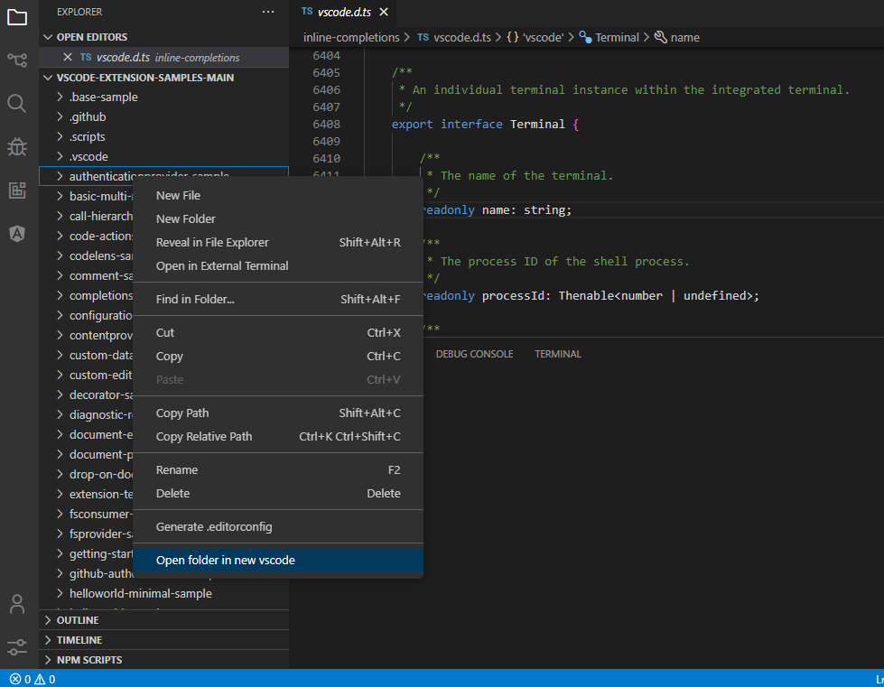
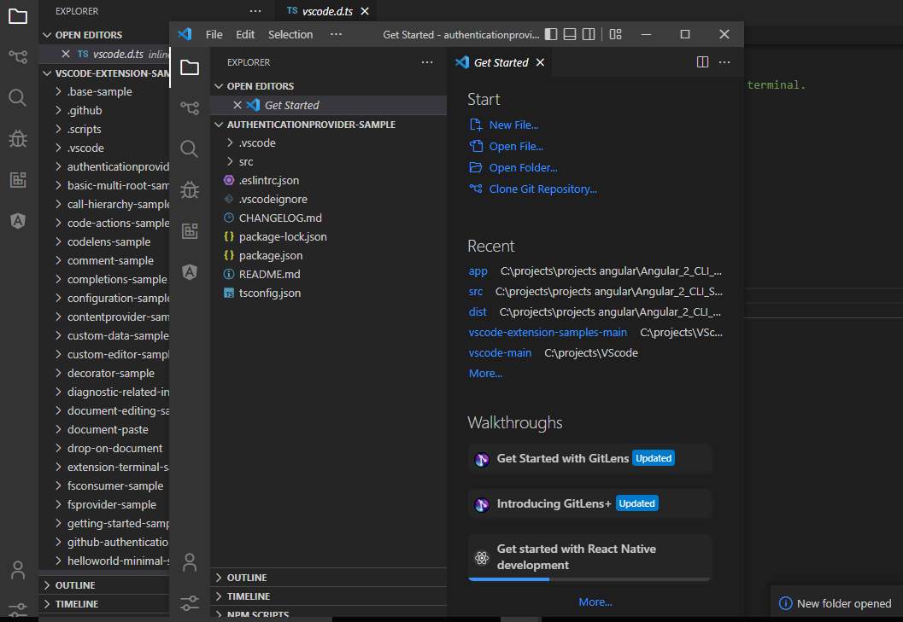

# Open Folder In New Vscode

From the current workspace, directory opens the folder in the new `Visual Studio Code` window. it's a useful extension for 
a code repository that holds many projects (monorepo).

## Requires Visual Studio Code Version: 1.69.0 and above 
## Features
### 1.0.0
You can right-click on any folder from the current workspace and select 'open folder in new vscode' 
that will open a new vs code window.

## Usage

> For example https://github.com/Microsoft/vscode-extension-samples holds the number of extension sample folders.

### In vscode-extension-samples directory there are multiple extensions example folders. right click on the folder and select 'open folder in new vscode'. 

### New vscode window will be open with the selected folder. now you can directly run 
- `npm install` in the terminal, then `F5` to run the sample

-----------------------------------------------------------------------------------------------------------

**Enjoy!**
